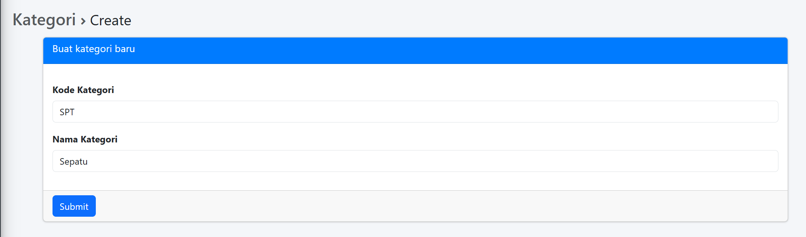
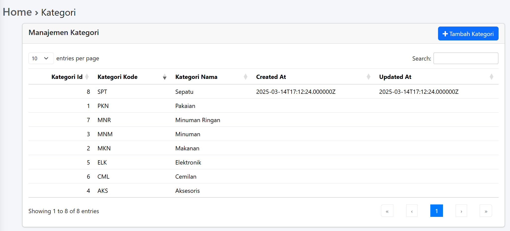
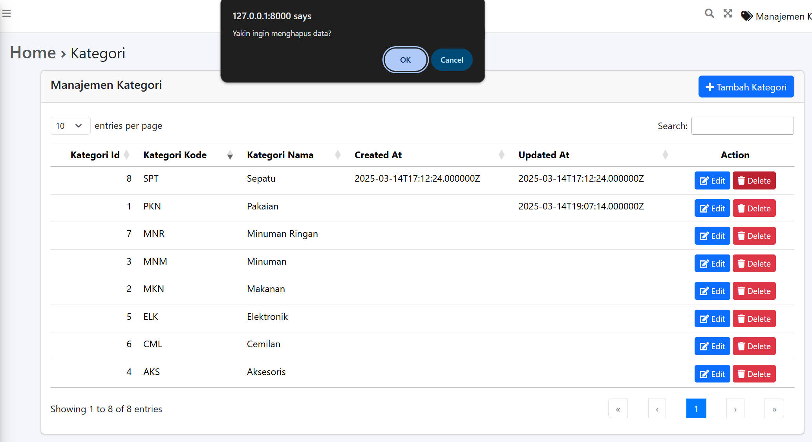

# Laporan Praktikum 5
<b>NAMA : Octrian Adiluhung TIto Putra<b> 
<b>KELAS : TI-2A<b> 
<b>ABSEN : 24<b> 
<b>NIM : 2341720078<b> 
 

## Praktikum 1 : Integrasi Laravel dengan AdminLte3
### OUTPUT
3. Buat file resources/views/layout/app.blade.php
 

 

4. Edit resources/views/welcome.blade.php, kemudian replace seluruh kodenya dengan 
kode berikut 
 

 

5. Kembali ke browser, menuju ke halaman awal. 
 

 

## Praktikum 2 : Integrasi dengan DataTables
### OUTPUT
4. Edit file resources/js/app.js
 

 

5. Buatlah file resources/saas/app.scss
 

 

6. Jalankan dengan npm run dev
 

 

7. Selanjutnya kita akan buat datatables untuk kategori 
 

 

8. Kita edit KategoriDatable untuk mengatur kolom apasaja yang ingin ditampilkan. Sesuaikan dengan kode program berikut
 

 

9. Ubah kategori model, sesuaikan seperti berikut
 

 

10. Ubah Kategori Controller sesuaikan dengan skrip berikut:
 

 

11. Buat folder kategori di dalam resources/view,  kemudian buat view blade index untuk kategori  resources/views/kategori/index.blade.php
 

 

14. Menset ViteJs / script type defaults
 

 

15. Isikan beberapa data ke table kategori
 

 

16. Datatables sudah dapat di load di /kategori
 

 

## Praktikum 3 : Membuat form kemudian menyimpan data dalam database 
### OUTPUT
1. Menyesuaikan routing, tambahkan dua routing berikut
 

 

2. Tambahkan dua function berikut dalam KategoriController
 

 

3. Dalam folder views/kategori, buatlah file dengan nama create.blade.php 
 

 

4. Kita lakukan pengecualian proteksi CsrfToken. Karena kita belum melakukan otentikasi
 

 

5. Akses kategori/create
 

 

6. Menambahkan kategori baru
 

 

7. Halaman kategori
 

 

## Tugas Praktikum 
### OUTPUT
1. Tambahkan button Add di halaman manage kategori, yang mengarah ke create kategori baru 
 

 

 

 

 

 
 
2. Tambahkan menu untuk halaman manage kategori, di daftar menu navbar
  
- Mengedit file adminlte pada config menjadi seperti kode dibawah ini
 

 

 

 
 
3. Tambahkan action edit di datatables dan buat halaman edit serta controllernya

  
- Datatables
 

 

  
- Controller
 

 

  
- Membuat view edit.blade.php
 

 

  
- Route
 

 

  
- Hasil
 

 

  
- Masuk ke halaman edit
 

 
 
4. Tambahkan action delete di datatables serta controllernya
  
- Datatables
 

 

  
- Controller
 

 

  
- Route
 

 

  
- Akan muncul notifikasi jika melakukan klik pada button delete
 

 

  
- Data dengan Kategori Nama sepatu berhasil dihapus
 

 