# Laporan Praktikum 5
<b>NAMA : Octrian Adiluhung TIto Putra<b> 
<b>KELAS : TI-2A<b> 
<b>ABSEN : 24<b> 
<b>NIM : 2341720078<b> 
 

## Praktikum 1 : $fillable:
### OUTPUT
Langkah 1 & 2
 
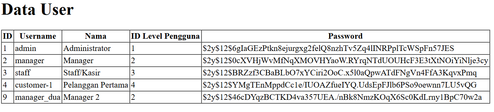
 
- Data manager 2 berhasil ditambahkan pada tabel m_user  

Langkah 4 & 5
 
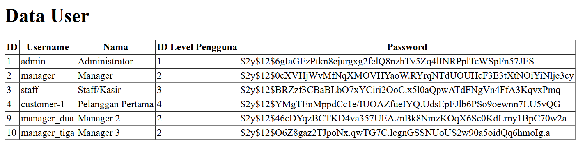
 
- Data manager 3 berhasil ditambahkan pada tabel m_user  

## Praktikum 2.1 : Retrieving Single Models 
### OUTPUT
Langkah 1 & 2
 
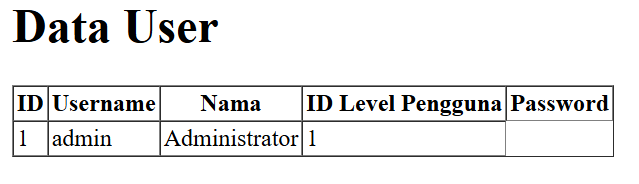
 
- Ditampilkan sebuah tabel yang  berisi 1 baris data, yaitu data user dengan id=1 

Langkah 4
 
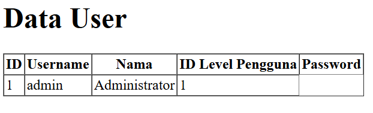
 
- Ditampilkan data user pertama yang memiliki level_id=1

Langkah 6
 
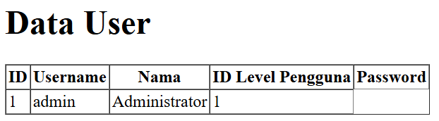
 
- Hasil yang ditampilkan sama dengan yang sebelumnya

Langkah 8
 
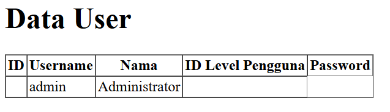
 
- Data username dan nama dari user dengan id=1 akan ditampilkan, jika data ditemukan maka fungsi abort(404) akan dijalankan

Langkah 10
 
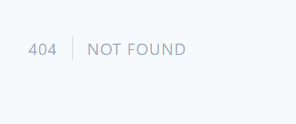
 
- Karena user dengan id=20 tidak ada maka fungsi abort(404) dijalankan

## Praktikum 2.2 : Not Found Exceptions 
### OUTPUT
Langkah 1
 
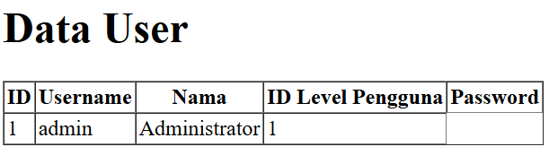
 
- Data dengaan id=1 bisa ditampilkan karena data nya ada di dalam tabel

Langkah 3
 
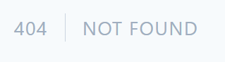
 
- Karena tidak ada data dengan username='manager9', maka muncul halaman error 404 Not Found.

## Praktikum 2.3 : Retreiving Aggregrates
### OUTPUT
Langkah 1
 
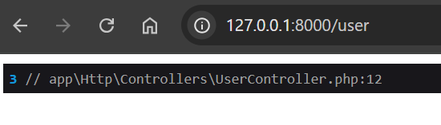
 
- count() akan menghitung jumlah record dalam tabel

Buat agar jumlah script pada langkah 1  bisa tampil pada halaman browser
 
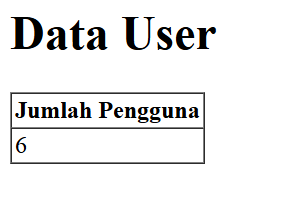
 
- Hasil yang ditampilkan adalah jumlah pengguna yang ada, data diambil dari proses count(user_id); yang menghitung jumlah baris pada kolom user_id

## Praktikum 2.4 : Retreiving or Creating Models
### OUTPUT
Langkah 1 & 2
 
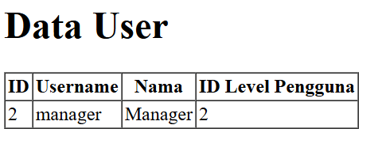
 
- data user dengan username=manager dan nama=Manager berhaasil ditemukan sehingga data tersebut ditampilkan di browser

Langkah 4
 
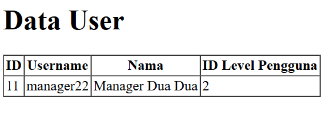
 
- Tidak ada data user dengan username=manager22 dan nama=Manager Dua Dua sehingga firstOrCreate() membuat record baru dengan nilai-nilai yang diberikan pada parameter 

Langkah 6
 
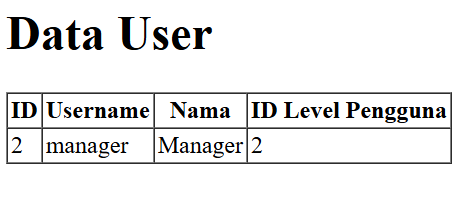
 
- Data user dengan username=manager dan nama=Manager berhasil ditemukan sehingga data user langsung ditampilkan

Langkah 8
 

 
- Data user pada parameter belum ada sehingga firsOrNew membuat record baru namun tidak langsung menyimpan ke databasem, melainkan akan dibuat objek baru di memori (tidak disimpan ke database) dengan nilai yang diberikan didalam parameter.

Langkah 9
 
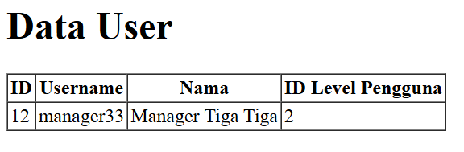
 
- Setelah dibuat objek baru didalam memori menggunakan firstOrNew, $user->save(); digunakan untuk menyimpan objek baru tersebut ke dalam database

## Praktikum 2.5 : Attribute Changes 
### OUTPUT
Langkah 1
 

 

Langkah 3
 

 

## Praktikum 2.6 : Create, Read, Update, Delete (CRUD)
### OUTPUT
Langkah 1 & 2
 

 

Langkah 4 s/d 6
 

 

Langkah 8 & 9
 

 

Langkah 11 s/d 13
 

 

Langkah 15 & 16
 

 

Langkah 18 & 19
 

 

## Praktikum 2.7 : Relationships
### OUTPUT
Langkah 2
 

 

Langkah 4 & 5
 

 